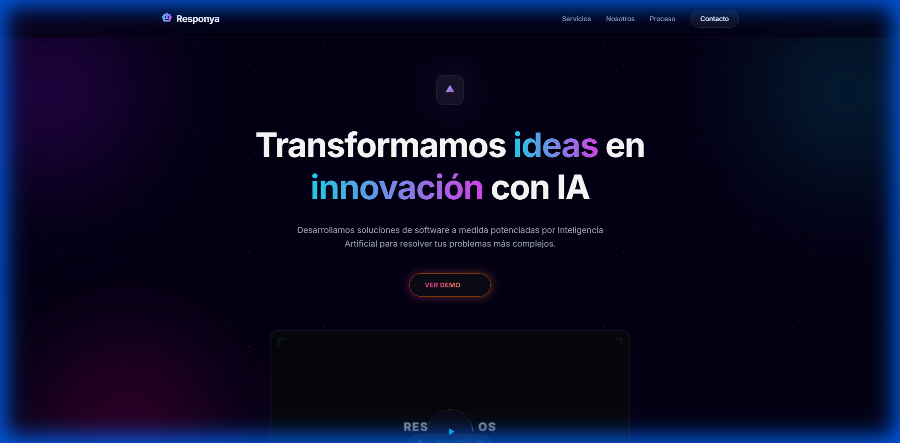
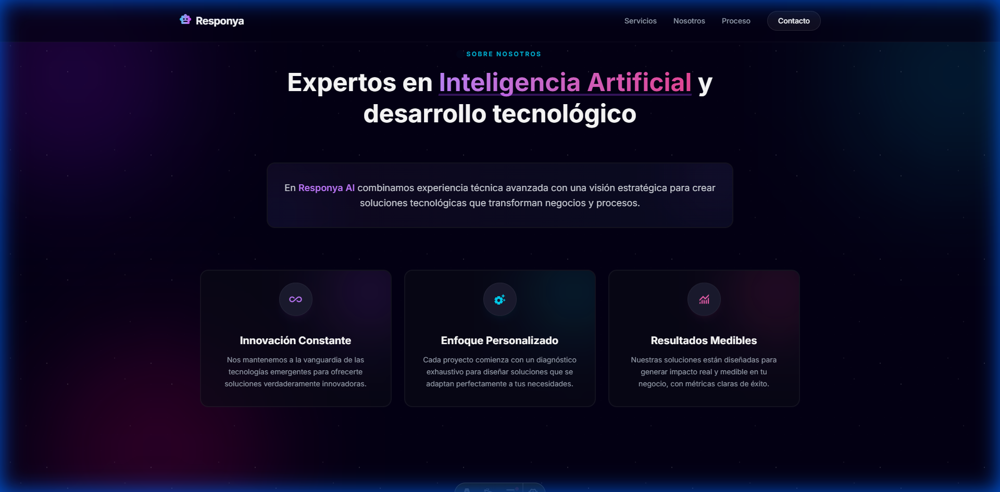
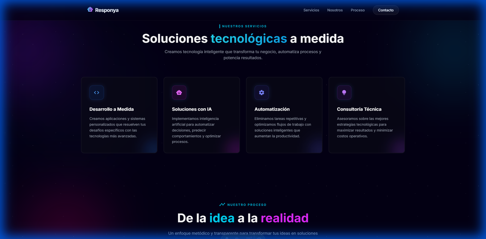
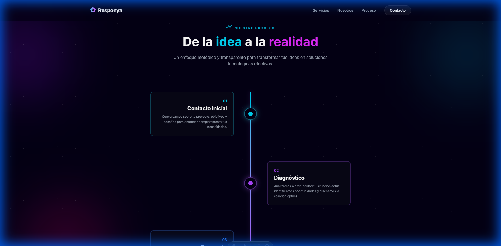
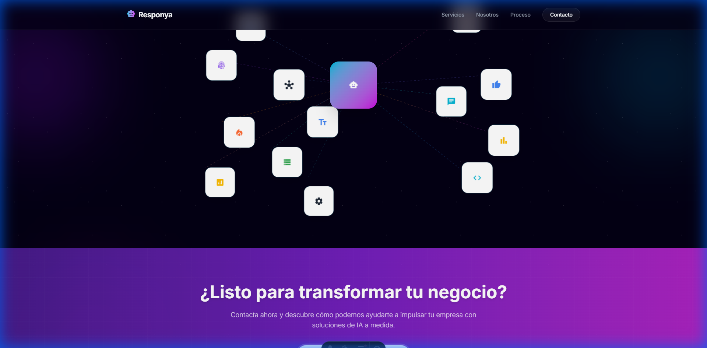

# 🚀 Responya - Soluciones de IA

Sitio web moderno y animado para Responya, desarrollado con **Astro.js** y **Tailwind CSS**. Presenta soluciones de Inteligencia Artificial y desarrollo tecnológico con un diseño premium y efectos visuales impresionantes.



## ✨ Características

- 🎨 **Diseño Moderno**: Interfaz premium con efectos glassmorphism y bordes neón
- 🌟 **Animaciones Fluidas**: Partículas de fondo, efectos parallax y transiciones suaves
- 📱 **Totalmente Responsive**: Optimizado para todos los dispositivos
- ⚡ **Alto Rendimiento**: Construido con Astro para máxima velocidad
- 🎭 **Efectos Visuales**: Iconos flotantes, líneas animadas y gradientes dinámicos
- 🔄 **Smooth Scroll**: Navegación suave entre secciones

## 📸 Capturas de Pantalla

### Sección Sobre Nosotros


### Servicios


### Nuestro Proceso


### Integraciones


### Contacto


## 🛠️ Tecnologías Utilizadas

- **[Astro](https://astro.build/)** - Framework web moderno
- **[Tailwind CSS](https://tailwindcss.com/)** - Framework de CSS utility-first
- **[Google Fonts](https://fonts.google.com/)** - Tipografía Inter
- **[Material Symbols](https://fonts.google.com/icons)** - Iconos

## 📦 Estructura del Proyecto

```
responya-astro/
├── src/
│   ├── components/
│   │   ├── Card.astro              # Cards de "Sobre Nosotros"
│   │   ├── FloatingIcon.astro      # Iconos flotantes de integraciones
│   │   ├── Footer.astro            # Footer con redes sociales
│   │   ├── Header.astro            # Navegación principal
│   │   ├── Hero.astro              # Sección hero con video
│   │   ├── ProcessStep.astro       # Pasos del proceso
│   │   └── ServiceCard.astro       # Cards de servicios
│   ├── layouts/
│   │   └── Layout.astro            # Layout principal con efectos de fondo
│   ├── pages/
│   │   └── index.astro             # Página principal
│   └── styles/
│       └── global.css              # Estilos globales y animaciones
├── public/                         # Archivos estáticos
├── screenshots/                    # Capturas de pantalla
├── astro.config.mjs               # Configuración de Astro
├── tailwind.config.mjs            # Configuración de Tailwind
└── package.json
```

## 🚀 Inicio Rápido

### Prerrequisitos

- Node.js 18+ 
- npm o pnpm

### Instalación

1. Clona el repositorio:
```bash
git clone https://github.com/josephsmithvaz777-svg/responya-landing.git
cd responya-landing
```

2. Instala las dependencias:
```bash
npm install
```

3. Inicia el servidor de desarrollo:
```bash
npm run dev
```

4. Abre tu navegador en `http://localhost:4321`

## 📜 Scripts Disponibles

```bash
npm run dev          # Inicia el servidor de desarrollo
npm run build        # Construye el proyecto para producción
npm run preview      # Previsualiza la build de producción
npm run astro        # Ejecuta comandos de Astro CLI
```

## 🎨 Secciones del Sitio

1. **Hero** - Presentación principal con video y CTA
2. **Sobre Nosotros** - Valores y propuesta de valor
3. **Servicios** - 4 servicios principales con iconos
4. **Proceso** - Timeline de 5 pasos del proceso de trabajo
5. **Integraciones** - Gráfico animado de herramientas compatibles
6. **Contacto** - CTA con botón de WhatsApp
7. **Footer** - Redes sociales y enlaces legales

## 🎯 Características Técnicas

### Animaciones
- Partículas de fondo (estrellas) con animación continua
- Blobs de colores con efecto parallax
- Cards con efectos hover y bordes neón
- Iconos flotantes con movimiento orbital
- Líneas de conexión animadas con gradientes
- Smooth scroll entre secciones

### Optimizaciones
- Componentes reutilizables de Astro
- CSS modular con Tailwind
- Lazy loading de imágenes
- Código optimizado para producción
- SEO-friendly con meta tags

## 🌐 Despliegue

### Vercel (Recomendado)

1. Conecta tu repositorio de GitHub a Vercel
2. Vercel detectará automáticamente Astro
3. Deploy automático en cada push

### Netlify

1. Conecta tu repositorio a Netlify
2. Build command: `npm run build`
3. Publish directory: `dist`

### Otros Servicios

El proyecto es compatible con cualquier servicio que soporte sitios estáticos:
- GitHub Pages
- Cloudflare Pages
- AWS S3 + CloudFront

## 👨‍💻 Autor

**Joseph Vazquez**
- GitHub: [@josephsmithvaz777-svg](https://github.com/josephsmithvaz777-svg)

## 📄 Licencia

Este proyecto es propiedad de Responya AI. Todos los derechos reservados © 2026.

## 🤝 Contribuciones

Las contribuciones son bienvenidas. Por favor:

1. Fork el proyecto
2. Crea una rama para tu feature (`git checkout -b feature/AmazingFeature`)
3. Commit tus cambios (`git commit -m 'Add some AmazingFeature'`)
4. Push a la rama (`git push origin feature/AmazingFeature`)
5. Abre un Pull Request

## 📞 Contacto

Para consultas sobre el proyecto:
- Email: info@responya.com
- Website: [responya.com](https://responya.com)

---

⭐ Si te gusta este proyecto, no olvides darle una estrella en GitHub!
